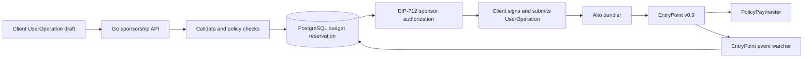

# Gasless Policy Engine

Gasless Policy Engine lets an application pay transaction fees for selected user actions without handing users a gas token.

A sponsor cannot safely approve every request: an altered call, repeated authorization, or burst of expensive operations can drain the paymaster deposit. This Go service checks the actual account call against versioned policy, reserves a budget in PostgreSQL, and signs an authorization tied to one ERC-4337 UserOperation. A paymaster contract enforces that authorization on-chain, while a watcher reconciles confirmed gas cost and releases unused reserved capacity.

## Sponsorship path



The service derives the target and selector from fixed-account calldata instead of trusting client-supplied labels. Its EIP-712 signature binds the operation and constraints. EntryPoint v0.9 and `PolicyPaymaster` validate the authorization during execution. The watcher uses confirmed `UserOperationEvent.actualGasCost` to settle the reservation; unspent capacity is released.

## Engineering focus

| Problem | Design and resulting behavior |
| --- | --- |
| A request claims an allowed action while encoding another call. | The backend decodes the fixed account call and checks its real target and selector; mutated calldata fails admission. |
| Concurrent requests compete for a sponsor budget. | PostgreSQL reserves quota and Wei capacity atomically, so local approvals cannot exceed configured limits. |
| A client retries after losing an API response. | The signed artifact is persisted and returned for an identical retry; a conflicting request is rejected rather than consuming another reservation. |
| A signature could be replayed or moved to another context. | Typed authorization binds the intended UserOperation and EntryPoint context; the paymaster verifies it on-chain. |
| Reserved cost differs from actual cost. | Confirmed EntryPoint events settle `actualGasCost` and release unused capacity instead of charging the entire hold. |
| Chain outcome is delayed or reorganized. | Reconciliation waits for configured confirmed chain evidence; an unused reservation can expire only after the required chain-time coverage. |

See [policy](docs/policy.md), [accounting](docs/accounting.md), [signing](docs/signing.md), and [reconciliation](docs/reconciliation.md) for the exact checks and state transitions.

## Quick start

**Clone without `--recurse-submodules`, then prepare dependencies before any build or demo.** The repository pins account-abstraction as a submodule and carries checksum-checked Alto and OpenZeppelin source bundles. `prepare_dependencies.py` restores the expected source trees and their pinned nested revisions.

Install Go 1.27.1, PostgreSQL 18 server tools, Python 3, Ruby, ripgrep, Foundry/Anvil, Node.js, pnpm, Docker, and `make`. The first setup downloads the exact pinned public dependencies.

```sh
git clone https://github.com/demo-lenoir/Gasless-Policy-Engine.git Gasless-Policy-Engine
cd Gasless-Policy-Engine
python3 scripts/prepare_dependencies.py
go mod download
forge build
make demo
go test ./...
```

Set `LOCAL_NODE_BIN` if Node.js is outside `PATH`. `forge build` creates the EntryPoint artifact consumed by the local demo. The demo starts disposable PostgreSQL and Anvil instances, deploys EntryPoint, paymaster, account, and target, starts Alto, and calls the sponsorship API. It checks approved and denied requests, identical and conflicting retries, zero account gas balance, mutated-call rejection, bundler inclusion, exact gas settlement, and unused hold release. It writes local metadata to `build/local-deployment.json`; see [demo steps](docs/demo.md).

`make verify-phase6` is the full local gate. It runs Go race and fuzz checks, Foundry tests, PostgreSQL migration/integration, direct and Alto execution, reconciliation, Docker and scan checks, a clean-clone replay, and unsigned local release artifacts. See [testing](docs/testing.md) and the [release procedure](docs/release.md). The optional `go run ./cmd/gasless` needs a runtime policy, issuance admission file, database and RPC URLs, scoped bearer token, and development signer key; the [operations guide](docs/operations.md) lists those settings.

## Repository map

```text
cmd/                  service, demo, and recovery commands
internal/             policy, admission, signing, store, reconciliation, API
contracts/            paymaster, account fixture, Foundry tests
migrations/           PostgreSQL schema
config/               local policy and admission examples
dependency-snapshots/ pinned Alto and OpenZeppelin source bundles
scripts/              dependency preparation, demo, verification
api/                  OpenAPI contract
docs/                 design, operations, evidence, and ADRs
```

The [dependency manifest](dependency-snapshots/manifest.json) records upstream and local snapshot commits and bundle hashes. The [architecture](docs/architecture.md), [failure matrix](docs/failure-matrix.md), [threat model](docs/threat-model.md), [test evidence](docs/evidence.md), and [ADRs](docs/adr/) cover the deeper design.

## Scope and trust

The PostgreSQL budget limits authorizations; the EntryPoint deposit supplies actual gas. RPC log completeness is trusted rather than cryptographically proven, and configured confirmations are not universal finality. The local Alto run does not establish production ERC-7562 mempool acceptance. Development keys are test-only. This repository has no public-chain deployment evidence, production history, or independent audit.

Apache-2.0. See [LICENSE](LICENSE).
